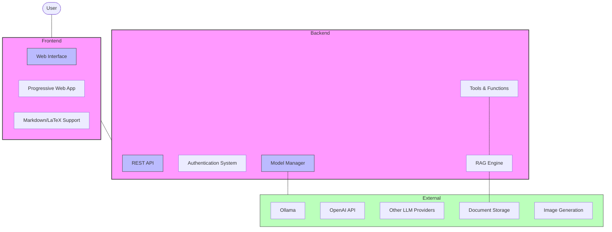

# Sage : Open WebUI 👋

## v0.5.13 See [CHANGELOG](./CHANGELOG.md) for more details.

[](


[](https://discord.gg/5rJgQTnV4s)
[](https://github.com/sponsors/tjbck)

**Open WebUI is an [extensible](https://docs.openwebui.com/features/plugin/), feature-rich, and user-friendly self-hosted AI platform designed to operate entirely offline.** It supports various LLM runners like **Ollama** and **OpenAI-compatible APIs**, with **built-in inference engine** for RAG, making it a **powerful AI deployment solution**.

For more information, be sure to check out our [Open WebUI Documentation](https://docs.openwebui.com/).


## Architecture Overview

Open WebUI follows a modular architecture that integrates various components to deliver a comprehensive AI interaction platform:



## Key Features of Open WebUI

- 🚀 **Effortless Setup**: Install seamlessly using Docker or Kubernetes (kubectl, kustomize or helm) for a hassle-free experience with support for both `:ollama` and `:cuda` tagged images.

- 🤝 **Ollama/OpenAI API Integration**: Integrate OpenAI-compatible APIs for versatile conversations alongside Ollama models. Connect with **LMStudio, GroqCloud, Mistral, OpenRouter, and more**.

- 🛡️ **Granular Permissions and User Groups**: Create detailed user roles and permissions for a secure environment and customized user experiences.

- 📱 **Responsive Design & PWA Support**: Enjoy a seamless experience across all devices with Progressive Web App support for mobile.

- ✒️🔢 **Full Markdown and LaTeX Support**: Comprehensive formatting capabilities for enriched interaction.

- 🎤📹 **Voice/Video Call Integration**: Dynamic communication with hands-free voice and video features.

- 🛠️ **Model Builder**: Create Ollama models via the Web UI with custom characters/agents and import models through [Open WebUI Community](https://Sage.Education/).

- 🐍 **Python Function Calling**: Built-in code editor with BYOF (Bring Your Own Function) support for seamless Python integration.

- 📚 **Local RAG Integration**: Load documents directly into conversations or build a document library, accessible with the `#` command.

- 🔍 **Web Search for RAG**: Perform searches using various providers and inject results directly into your conversations.

- 🌐 **Web Browsing**: Incorporate websites into chats using the `#` command followed by a URL.

- 🎨 **Image Generation**: Integrate with AUTOMATIC1111, ComfyUI, or DALL-E for visual content creation.

- ⚙️ **Multi-Model Conversations**: Engage with various models simultaneously to leverage their unique strengths.

- 🔐 **Role-Based Access Control (RBAC)**: Secure access with restricted permissions for model creation and usage.

- 🌐🌍 **Multilingual Support**: Experience Open WebUI in your preferred language with i18n support.

- 🧩 **Plugin Framework**: Extend functionality with the [Pipelines Plugin Framework](https://github.com/open-webui/pipelines) for custom integrations.

- 🌟 **Continuous Updates**: Regular improvements, fixes, and new features.

Want to learn more? Check our [documentation](https://docs.openwebui.com/features) for a comprehensive overview!

## 🔗 Open WebUI Community

Explore our sibling project, [Open WebUI Community](https://Sage.Education/), to discover, download, and explore customized Modelfiles for enhancing your chat interactions! 🚀

## Installation Options 🚀

### Quick Start with Make
```bash
make it_run
```

### Python pip Installation 🐍
```bash
pip install open-webui
open-webui serve
```

### Docker Installation 🐳

> [!NOTE]  
> Always include `-v open-webui:/app/backend/data` to prevent data loss.

**Standard Installation:**
```bash
docker run -d -p 3000:8080 --add-host=host.docker.internal:host-gateway \
  -v open-webui:/app/backend/data --name open-webui --restart always \
  ghcr.io/open-webui/open-webui:main
```

**With CUDA Support:**
```bash
docker run -d -p 3000:8080 --gpus all --add-host=host.docker.internal:host-gateway \
  -v open-webui:/app/backend/data --name open-webui --restart always \
  ghcr.io/open-webui/open-webui:cuda
```

**OpenAI API Only:**
```bash
docker run -d -p 3000:8080 -e OPENAI_API_KEY=your_secret_key \
  -v open-webui:/app/backend/data --name open-webui --restart always \
  ghcr.io/open-webui/open-webui:main
```

**With Bundled Ollama:**
```bash
docker run -d -p 3000:8080 --gpus=all -v ollama:/root/.ollama \
  -v open-webui:/app/backend/data --name open-webui --restart always \
  ghcr.io/open-webui/open-webui:ollama
```

After installation, access Open WebUI at [http://localhost:3000](http://localhost:3000).

## Troubleshooting

If you encounter connection issues, try using the `--network=host` flag:

```bash
docker run -d --network=host -v open-webui:/app/backend/data \
  -e OLLAMA_BASE_URL=http://127.0.0.1:11434 --name open-webui --restart always \
  ghcr.io/open-webui/open-webui:main
```

Then access at [http://localhost:8080](http://localhost:8080)

### Keeping Updated

Update with Watchtower:
```bash
docker run --rm --volume /var/run/docker.sock:/var/run/docker.sock \
  containrrr/watchtower --run-once open-webui
```

For detailed guides, visit our [documentation](https://docs.openwebui.com/getting-started/updating).

## License 📜

This project is licensed under the [BSD-3-Clause License](LICENSE) - see the [LICENSE](LICENSE) file for details. 📄

## Support 💬

For questions, suggestions, or assistance, please open an issue or join our
[Open WebUI Discord community](https://discord.gg/5rJgQTnV4s)! 🤝

## Star History

<a href="https://star-history.com/#open-webui/open-webui&Date">
  <picture>
    <source media="(prefers-color-scheme: dark)" srcset="https://api.star-history.com/svg?repos=open-webui/open-webui&type=Date&theme=dark" />
    <source media="(prefers-color-scheme: light)" srcset="https://api.star-history.com/svg?repos=open-webui/open-webui&type=Date" />
    
  </picture>
</a>

---

Created by [Startr.Cloud](https://startr.cloud/) and our [many contributors](https://github.com/opencoca/AI-WEB-openwebui/graphs/contributors). 🚀